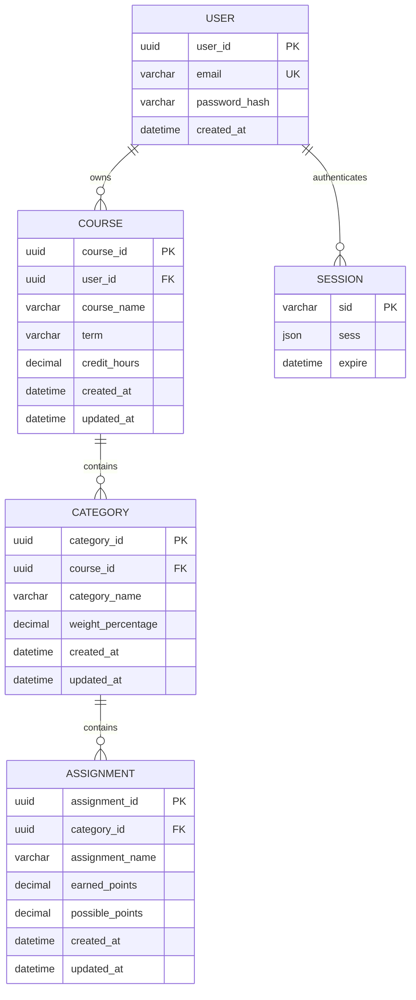
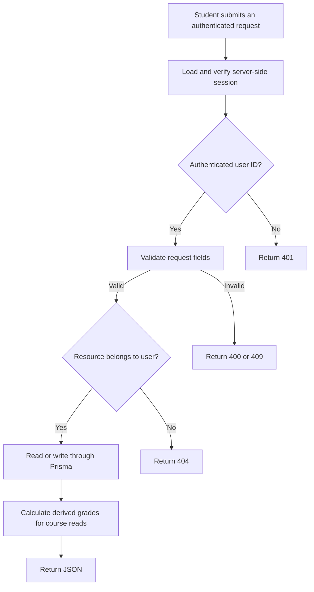
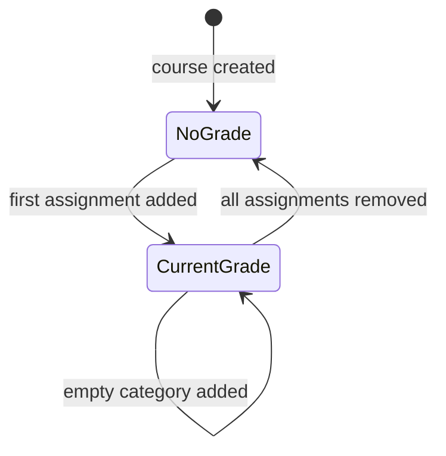

# Milestone 1 Analysis Model

## Domain model

## Entity responsibilities and invariants

| Entity | Responsibility | Important invariants |
|--------|----------------|----------------------|
| User | Owns all private academic data | Email is unique; password is stored only as an Argon2id hash |
| Session | Connects a browser cookie to authenticated server state | Expires after the configured lifetime; regenerated at authentication |
| Course | Groups one class, term, credit hours, and categories | Belongs to one user; credit hours are 0.5-30 |
| Category | Defines a weighted grading division | Belongs to one course; weight is greater than 0 and at most 100; course total cannot exceed 100 |
| Assignment | Stores one actual grade | Belongs to one category; earned points are non-negative; possible points are positive |

Course deletion cascades to categories and assignments. Category deletion cascades to assignments. Ownership is derived from `Assignment -> Category -> Course -> User`, so assignment records do not duplicate a user ID. The session-to-user association is logical: the user ID is stored inside session JSON rather than through a database foreign key.

## Derived values

The following values are computed on reads and are not stored:

- category point totals and average percentage;
- normalized category share and percentage-point contribution;
- current course average, letter grade, and grade points;
- cumulative GPA and graded credit hours.

This prevents stored summary values from becoming stale after an assignment change.

## Main behavior and data flow

Authentication routes omit the protected-resource ownership step. Health checks omit both authentication and ownership.

## Grade state model

Category configuration is an independent condition:

- **Incomplete:** weights total less than 100%.
- **Complete:** weights total exactly 100%.
- **Rejected:** a requested change would make weights exceed 100%.

A course may have a current grade while its configuration is incomplete. The interface presents both facts rather than hiding the calculation.

## Calculation flow

1. Sum earned and possible points within each category.
2. Divide each graded category's earned total by its possible total.
3. Exclude categories without assignments.
4. Normalize the remaining category weights and sum their contributions.
5. Convert the current course average to A-F grade points.
6. Weight each graded course's grade points by its credit hours to calculate cumulative GPA.
