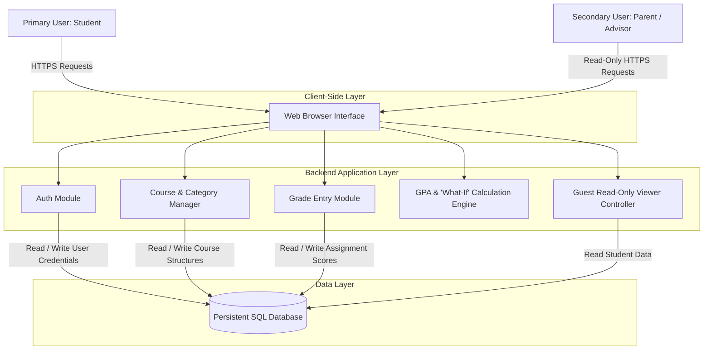

```mermaid
graph TD
    %% User Roles
    Student[Primary User: Student]
    Guest[Secondary User: Parent / Advisor]

    %% Frontend Layer
    subgraph Client [Client-Side Layer]
        UI[Web Browser Interface]
    end

    %% Application / API Layer
    subgraph Server [Backend Application Layer]
        Auth[Auth Module]
        CourseMgr[Course & Category Manager]
        GradeMgr[Grade Entry Module]
        CalcEngine[GPA & 'What-If' Calculation Engine]
        AccessCtrl[Guest Read-Only Viewer Controller]
    end

    %% Database Layer
    subgraph Data [Data Layer]
        DB[(Persistent SQL Database)]
    end

    %% Connections
    Student -->|HTTPS Requests| UI
    Guest -->|Read-Only HTTPS Requests| UI
    
    UI --> Auth
    UI --> CourseMgr
    UI --> GradeMgr
    UI --> CalcEngine
    UI --> AccessCtrl

    Auth -->|Read / Write User Credentials| DB
    CourseMgr -->|Read / Write Course Structures| DB
    GradeMgr -->|Read / Write Assignment Scores| DB
    AccessCtrl -->|Read Student Data| DB
```