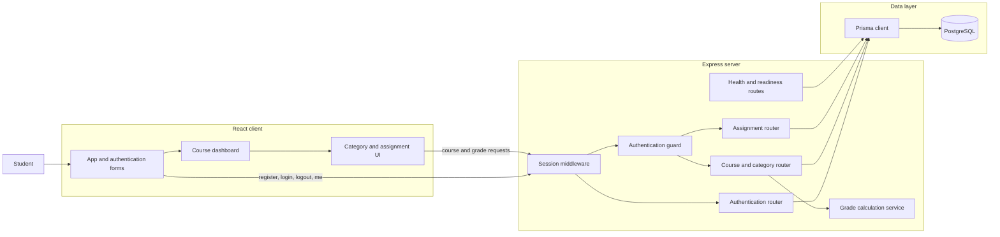
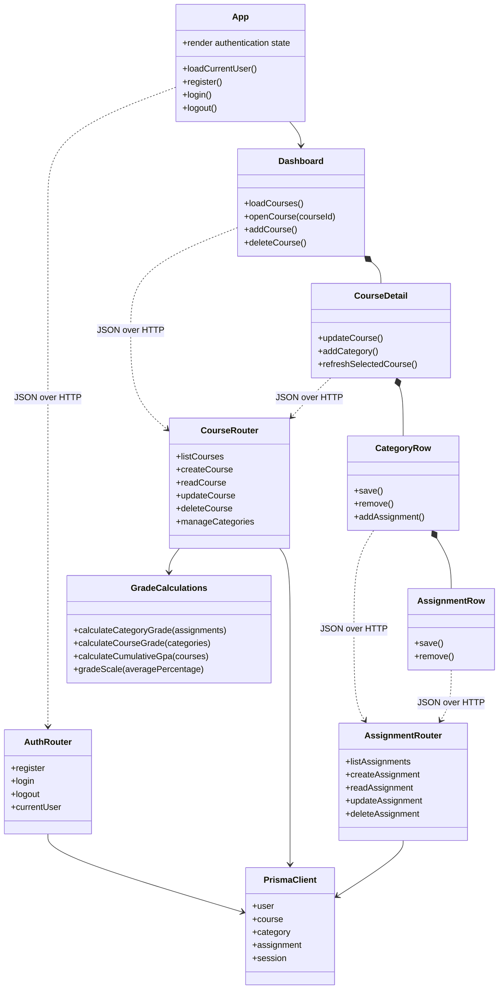

# Milestone 1 Architecture and Module Boundaries

The Milestone 1 application is a React client backed by one Express API and PostgreSQL database. The browser communicates only through `/api` routes. Express middleware establishes the session and authenticated user before protected routers run. Prisma is the only module that talks directly to PostgreSQL.

## Boundary rules

- The React client renders state and sends JSON requests; it does not access the database or calculate authoritative grades.
- Session middleware loads the signed session. The authentication guard rejects protected requests without a user ID.
- Routers validate HTTP input, enforce ownership, coordinate Prisma operations, and serialize responses.
- The calculation service contains pure category, course, letter-grade, and GPA formulas. It never writes data.
- Prisma owns database queries and migrations. PostgreSQL constraints protect point ranges, weights, relationships, and cascade deletion.
- What-if simulation and guest viewing are intentionally outside this Milestone 1 boundary.

## Design types and operations

Grade Tracker uses functional React components and router factories instead of requiring every responsibility to be represented by a JavaScript class. The following design-level view is the TypeScript equivalent of a design-class diagram: it shows the principal components, interfaces, public operations, and dependencies without implying runtime classes that do not exist in the source.

The request and response structures shared across these boundaries are defined in [api-design.md](api-design.md). The persisted relationships and invariants are defined in [analysis-model.md](analysis-model.md).
