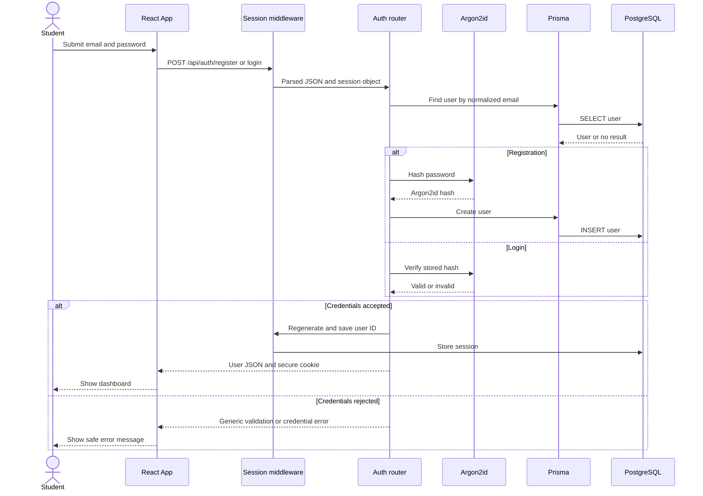
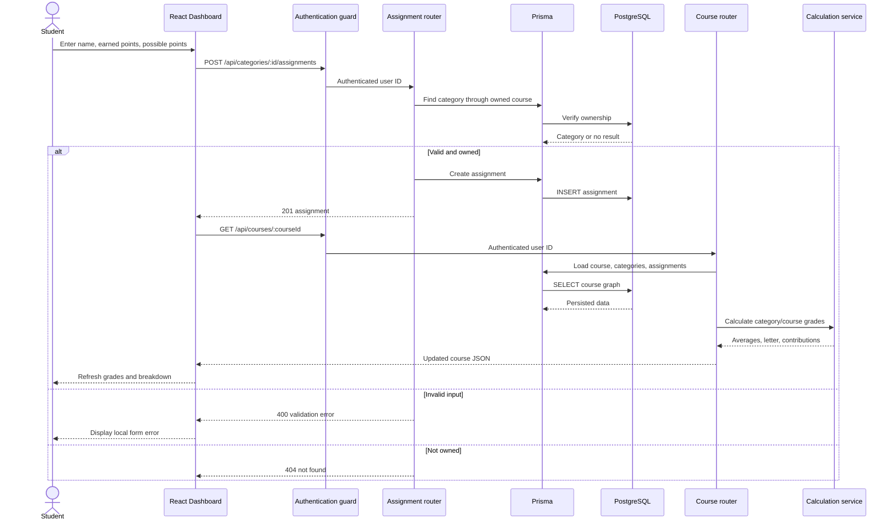

# Milestone 1 Component Designs

This document expands two important MVP use cases into component-level designs.

## Design A: Secure authentication

**Use case:** UC-01 / US-01  
**Components:** React `App`, authentication router, session middleware, Argon2id, Prisma, PostgreSQL.

### Responsibilities

| Component | Responsibility |
|-----------|----------------|
| React App | Collect labeled input, submit credentials, display errors, and restore `/me` sessions |
| Session middleware | Parse/sign the cookie and load/save server-side session state |
| Authentication router | Normalize input, enforce password rules, coordinate hashing and persistence |
| Argon2id | Hash new passwords and verify login attempts |
| Prisma/PostgreSQL | Enforce unique emails and persist users/sessions |

### Security decisions

- Login failures use one generic message.
- The session is regenerated after successful authentication to prevent session fixation.
- Cookies are HTTP-only, `SameSite=Lax`, and secure in production.
- Protected routers use only the authenticated session user ID.
- Responses never include the password hash.

### Failure behavior

- Duplicate registration: `409`.
- Invalid registration input: `400`.
- Invalid login: `401`.
- Missing or expired session on `/me`: `401` and stale session cleanup.
- Unexpected storage or hashing error: centralized `500` response.

## Design B: Enter a grade and recalculate academic standing

**Use cases:** UC-03 and UC-04 / US-03 and US-04  
**Components:** React `Dashboard`, authentication guard, assignment router, course router, calculation service, Prisma, PostgreSQL.

### Responsibilities

| Component | Responsibility |
|-----------|----------------|
| React Dashboard | Collect scores, show loading/errors, refresh course and GPA data after mutations |
| Authentication guard | Stop unauthenticated requests before protected routers |
| Assignment router | Validate point data, enforce category ownership, and perform CRUD |
| Course router | Load the owned course graph and serialize stored plus calculated data |
| Calculation service | Apply pure category, weighted course, letter-grade, contribution, and GPA formulas |
| Prisma/PostgreSQL | Persist scores, enforce constraints, and cascade deletes |

### Calculation behavior

1. Assignment writes store only actual input data.
2. The subsequent course read recomputes every derived value.
3. Empty categories are excluded and graded weights are normalized.
4. The dashboard identifies incomplete setup and labels the result as current.
5. Course grade points feed the credit-hour-weighted cumulative GPA on the course-list response.

### Failure and recovery behavior

- Failed mutations leave the form values visible so the student can correct them.
- The API rejects invalid precision and impossible point values before storage.
- Unowned resources return `404` for reads and mutations.
- If the refresh fails after a successful write, the saved database value remains correct and appears on the next reload.
- Deleting a category or course relies on database cascades so orphaned assignments cannot remain.
